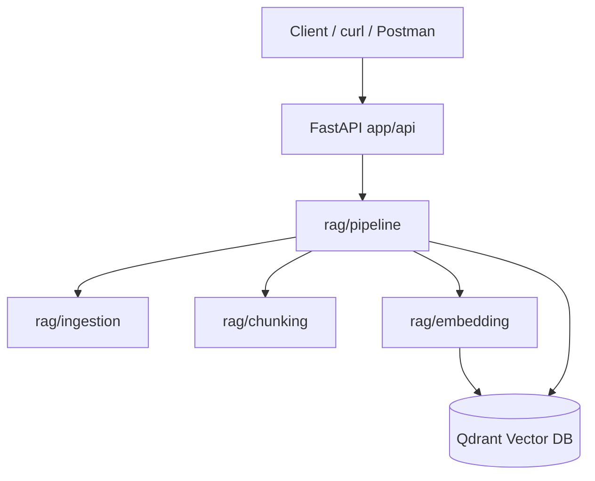

# Architecture — Week 1 Minimal RAG

## System diagram

## Module boundaries

| Module | Responsibility | Week |
|--------|----------------|------|
| `app/config.py` | Centralized settings via env | 1 |
| `app/logging_config.py` | JSON structured logs | 1 |
| `app/api/` | HTTP contracts, validation | 1 |
| `app/rag/ingestion.py` | PDF / Markdown parsing | 1–2 |
| `app/rag/chunking.py` | Size + overlap splitting | 1–3 |
| `app/rag/embedding.py` | Sentence-transformer encode | 1–4 |
| `app/rag/vector_store.py` | Qdrant upsert / search | 1–5 |
| `app/rag/pipeline.py` | Index + retrieve + query | 1–6 |
| `training/` | Reranker (placeholder) | 3 |
| `evaluation/` | Hit@K metrics (placeholder) | 2 |

## Request flows

### Index flow

1. Upload or path → `ingestion` → `Document`
2. `chunking` → list of `Chunk`
3. `embedding` (batched, `torch.no_grad`) → vectors
4. `vector_store.upsert` → Qdrant

### Query flow

1. Question → query embedding
2. Qdrant cosine search → top-k `RetrievedChunk`
3. Context assembly → LLM or retrieval-only answer
4. Response with `citations` and `latency_ms`

## Design decisions (interview prep)

- **Cosine distance in Qdrant** — Matches normalized sentence embeddings; scale-invariant direction similarity.
- **Singleton pipeline via `@lru_cache`** — Avoid reloading the embedding model on every request.
- **Optional OpenAI** — Week 1 works offline; add `OPENAI_API_KEY` when ready for full generation.
