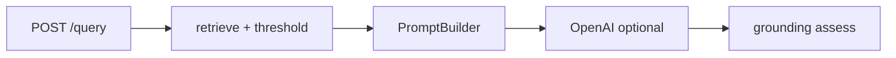

# 检索设计报告 — Week 2

## 1. 目标

在 Week 3 重排序（reranker）训练前，提升**检索质量可见性**：

- 通过 Prompt 版本化支持可控、可复现的 grounded 生成
- 增加引用与拒答护栏（citation + refusal guardrails）
- 建立参数实验能力（`top_k`、`score_threshold`）
- 使用标准指标评估：Hit@K、Recall@K、MRR

## 2. 架构新增




| 组件        | 路径                      | 职责                         |
| --------- | ----------------------- | -------------------------- |
| Prompt 版本 | `app/rag/prompts.py`    | 提供 v1/v2/v3 模板             |
| Grounding | `app/rag/grounding.py`  | 校验引用下标、识别拒答                |
| 指标评估      | `evaluation/metrics.py` | 计算 Hit@K、Recall@K、MRR      |
| 错误协议      | `app/exceptions.py`     | 统一 `error_code` 与 HTTP 状态码 |


## 3. 实验（本周最小必做）


| 设置                        | Hit@3 | MRR    | 备注          |
| ------------------------- | ----- | ------ | ----------- |
| `top_k=5, threshold=null` | 0.75  | 0.6333 | 基线          |
| `top_k=5, threshold=0.35` | 0.75  |        | 更高精度，可能牺牲召回 |


说明：以上两组参数实验可直接复用现有索引完成，能覆盖 Week 2 的核心结论（阈值对检索结果质量与召回的影响）。

**可选后续（非本周必做）**

- `chunk_overlap=32 vs 64`：需要重新切分并重新入库，实验成本较高，建议放到 Week 3 的检索优化阶段统一执行。

运行命令：

```bash
./scripts/run_week2_demo.sh
python scripts/build_eval_benchmark.py
curl -X POST http://127.0.0.1:8000/api/v1/evaluate/retrieval -H "Content-Type: application/json" -d '{"top_k": 10}'
```

## 4. 设计决策

1. **Prompt 作为代码 + 版本字符串**
  保持 API 协议不变，通过 `.env` 的 `PROMPT_VERSION` 快速切换模板；无需引入数据库模板系统即可完成 A/B 与回滚（Week 4+ 可扩展）。
2. **检索后做 score threshold 过滤**
  先向量检索，再按相似度阈值进行低成本过滤，减少低置信度上下文进入 LLM。
3. **Grounding 报告与答案分离**
  把 `grounding` 作为独立字段输出，便于调用方在生产环境进行策略拦截（例如阻断 ungrounded 回答）。
4. **Benchmark 半自动构建**
  通过脚本从 top-k 检索结果初始化标注，再由人工修正 `relevant_chunk_ids`，平衡效率与标注质量。

## 5. 常见故障与排查


| 现象                    | 排查方式                                                                   |
| --------------------- | ---------------------------------------------------------------------- |
| Hit@K 一直为 0           | 检查 benchmark 的 `relevant_chunk_ids` 是否为空；先运行 `build_eval_benchmark.py` |
| 所有 chunk 都被过滤         | `SCORE_THRESHOLD` 可能设置过高，与当前 embedding 分布不匹配                           |
| `grounded: false`     | 使用 v2 prompt 时答案缺少 `[n]` 引用，或引用索引不合法                                   |
| 503 `retrieval_error` | Qdrant 可能不可用，先检查 `GET /health/qdrant`                                  |


## 6. 面试表达要点

- **Hit@K vs Recall@K**：Hit@K 是“前 K 是否命中至少一个相关块”（二值）；Recall@K 是“相关块总体被召回的比例”。  
- **MRR 的意义**：强调第一个相关结果的排序位置，越靠前得分越高。  
- **为什么要做 Prompt 版本化**：为了可复现、可回滚、可对比实验，并能与离线评估结果一一对应。

