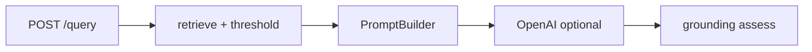

# Retrieval Design Report — Week 2

## 1. Goals

Improve **retrieval quality visibility** before Week 3 reranker training:

- Versioned prompts for grounded generation
- Citation and refusal guardrails
- Parameter experiments (top-k, score threshold)
- Standard metrics: Hit@K, Recall@K, MRR

## 2. Architecture additions



| Component | Path | Role |
|-----------|------|------|
| Prompt versions | `app/rag/prompts.py` | v1/v2/v3 templates |
| Grounding | `app/rag/grounding.py` | Citation index check, refusal detection |
| Metrics | `evaluation/metrics.py` | Hit@K, Recall@K, MRR |
| Errors | `app/exceptions.py` | `error_code` + HTTP status |

## 3. Experiments (fill after running)

| Setting | Hit@3 | MRR | Notes |
|---------|-------|-----|-------|
| top_k=5, threshold=null | | | baseline |
| top_k=5, threshold=0.35 | | | higher precision |
| chunk_overlap=32 vs 64 | | | re-index required |

Run:

```bash
./scripts/run_week2_demo.sh
python scripts/build_eval_benchmark.py
curl -X POST http://127.0.0.1:8000/api/v1/evaluate/retrieval -H "Content-Type: application/json" -d '{"top_k": 10}'
```

## 4. Design decisions

1. **Prompt as code + version string** — Same API contract; switch `PROMPT_VERSION` in `.env` without redeploying templates from a DB (Week 4+ can add store).
2. **Score threshold after search** — Cheap filter on cosine scores; reduces low-confidence context in LLM.
3. **Grounding report separate from answer** — Clients can block ungrounded responses in production.
4. **Benchmark auto-build script** — Bootstrap labels from top-k retrieval; human should refine gold `relevant_chunk_ids` for serious eval.

## 5. Failure modes & debug

| Symptom | Check |
|---------|--------|
| Hit@K always 0 | Empty `relevant_chunk_ids` in benchmark; run `build_eval_benchmark.py` |
| All chunks filtered | `SCORE_THRESHOLD` too high for your embedding scale |
| `grounded: false` | Answer missing `[n]` citations when using v2 prompt |
| 503 retrieval_error | Qdrant down; `GET /health/qdrant` |

## 6. Interview talking points

- **Hit@K vs Recall@K** — Hit: any relevant in top-k (binary per query). Recall: fraction of all relevant docs retrieved.
- **MRR** — Rewards ranking the first relevant chunk higher; sensitive to order.
- **Why prompt versioning?** — Reproducibility, rollback, and offline eval tied to a named template.
